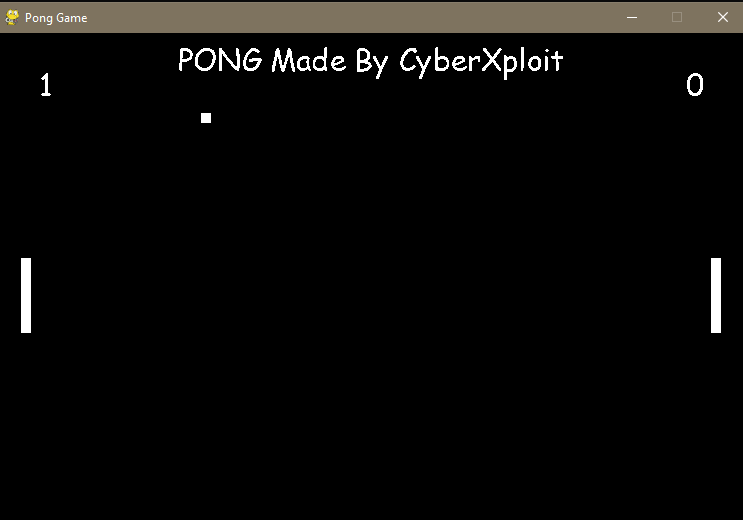

# Python Pong Game

Welcome to the Python Pong Game repository! This project is a simple implementation of the classic Pong game using Python. Have fun playing and exploring the code.



## Table of Contents

- [About the Game](#about-the-game)
- [How to Play](#how-to-play)
- [Getting Started](#getting-started)
- [Contributing](#contributing)
- [License](#license)

## About the Game

Pong is a classic arcade game where two players control paddles on opposite sides of the screen. The objective is to score points by bouncing a ball back and forth between the paddles. This project recreates that nostalgic gameplay in Python.

## How to Play

- Player 1 (left paddle) controls: `W` (up) and `S` (down).
- Player 2 (right paddle) controls: `Up arrow` (up) and `Down arrow` (down).

The game continues until one player reaches the score limit (typically 5 or 10).

## Getting Started

To run the Pong game locally or explore the code, follow these steps:

1. Clone this repository to your local machine:

   ```bash
   git clone https://github.com/cyberxploithausa/Pong-Game.git
   cd Pong-Game
   python pong.py
Enjoy the game and feel free to explore the code to understand how it works!

# Contributing
Contributions are welcome! If you'd like to enhance the game, fix bugs, or add new features, please follow these guidelines:

1. Fork this repository.
2. Create a new branch for your changes: git checkout -b feature/your-feature-name
3. Make your changes and test them thoroughly.
4. Commit your changes: git commit -m "Add your message here"
5. Push your changes to your forked repository: git push origin feature/your-feature-name
6. Create a pull request (PR) describing your changes.
Please maintain clear and concise code, and ensure the game remains user-friendly.

# License
This project is licensed under the MIT License. Feel free to use the code as a reference, modify it, or share it with others.
